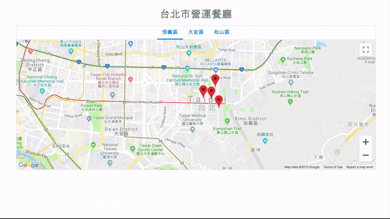

# # Google Api Practice: Map
This project is built with Vue.js and Google Map API, and is used to practice creating map, marker, and info window on a single page application.


## Project First Look


<p>&nbsp;</p>

## Project setup
### Clone

Clone this repository to your local machine

```
$ git clone https://github.com/smallpaes/google-map-api-practice-map.git
```

### Setup App
**1. Enter the project folder**

```
$ cd google-map-api-practice-map
```

**2. Install packages via npm**

```
$ npm install
```

**3. Place Google Map Project API Key**
> /public/index.html

```
<script src="https://maps.googleapis.com/maps/api/js?key=<YOUR_API_KEY>"></script>
```

**4. Compiles and hot-reloads for development**
```
$ npm run serve
```

**5. Visit the page**
```
http://localhost:8080/#/restaurants
```

___


## Related Blog Post

- [Medium: [筆記] 從零接觸 Google Map API：在 Vue.js 中實作地圖、地標、訊息視窗](http://tiny.cc/aibdez)

## Authors
- [Mike Huang](https://github.com/smallpaes)